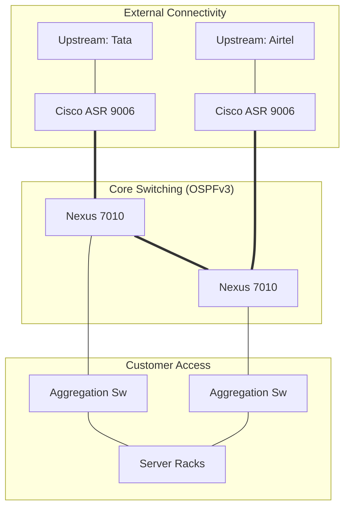

> "Most ISPs were dragging their feet on IPv6. We decided to enable Native IPv6 from Day 1."

# The Challenge

**Net4 India** was growing exponentially. We needed to support thousands of new VPS customers and Managed Services clients.

Our existing infrastructure was fragmented and running out of capacity.

**The Requirements:**

* **Scale:** Support **5,000+** new tenants.
* **Resilience:** **Tier-3 standards** (N+1 redundancy everywhere).
* **Future-Proofing:** The global **IPv4** pool was exhausting. We needed to be ready for the next generation of the internet.

---

# The Solution

I led the ground-up design of two new Data Centers in Delhi and Chennai.

## Tech Stack

* **Core Routing:** **Cisco ASR 9000 Series** (Edge) & **Nexus 7000** (Core)
* **Security:** **Juniper SRX** High-End Firewalls
* **Monitoring:** **Observium** (SNMP) & **RANCID** (Config Backup)
* **Protocol:** **Dual-Stack BGP** (IPv4 + IPv6)

## Technical Deep Dive

We moved away from a flat Layer 2 network to a robust **Layer 3 Clos Fabric**.

1. **Edge Layer:** **Cisco ASRs** peering with multiple upstream providers (Tata, Airtel, Vodafone) receiving full internet routing tables.
2. **Core Layer:** **Cisco Nexus 7000s** handling internal high-speed switching using **OSPFv3** as the IGP.
3. **Aggregation Layer:** Distributing traffic to customer racks via redundant **10G links**.

**Key Innovation: Day 1 Dual-Stack**
Every VLAN, every router interface, and every customer handoff was configured with both `0.0.0.0/0` and `::/0` reachability.

### BGP Architecture Diagram

# Business Impact

* **Capacity:** Enabled the onboarding of **5,000+ new VPS customers**, driving significant revenue growth.
* **Resilience:** Achieved **99.999% network uptime** during the first year of operations.
* **Readiness:** Fully compliant with government **IPv6 mandates** while competitors scrambled to upgrade.
