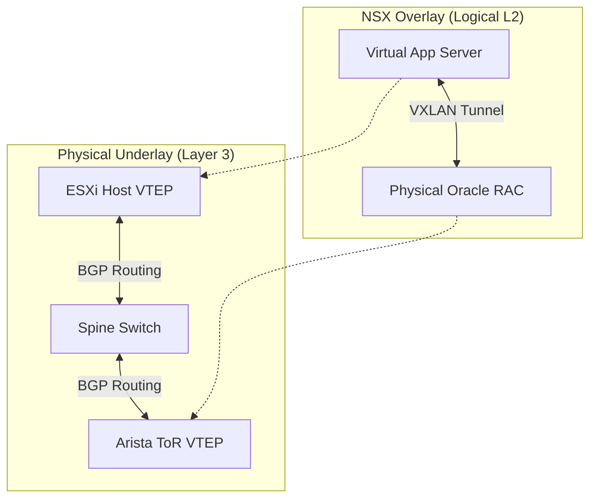

> "The requirement was simple but brutal: 'Migrate the Data Center to the Cloud, but do not change a single IP address.'"

# The Challenge

The client, a manufacturing giant, had a complex application stack.

* **Virtual Web/App:** Standard Linux VMs (Easy to migrate).
* **Physical Database:** Legacy **Oracle RAC** clusters running on bare metal (Impossible to virtualize).

They needed the Virtual Apps (in the Cloud) to talk to the Physical DBs as if they were on the same **Layer 2 subnet**.

---

# The Solution

We built a **Hybrid Cloud SDDC** on **IBM Cloud Bare Metal**.

## Tech Stack

* **Overlay:** **VMware NSX-V** (VXLAN)
* **Underlay:** **Arista Switches** (Hardware VTEP)
* **Connectivity:** **IBM Cloud Direct Link**

## Technical Deep Dive

We couldn't put the Oracle RAC nodes inside NSX because they were physical. So, we brought the **NSX Overlay** *to them*.

We configured the Top-of-Rack **Arista switches** to act as **Hardware VTEPs (VXLAN Tunnel Endpoints)**. The switch encapsulated the physical frames from the Oracle servers into **VXLAN packets** and shot them into the NSX Overlay.

To the Virtual App servers, the Oracle DB looked like just another VM on the same logical switch.

### Architecture Diagram

The routing complexity was extreme. We maintained two distinct routing tables:

1. **The Underlay (BGP):** Transporting VXLAN packets.
2. **The Overlay (OSPF):** Routing actual application traffic inside the tunnels.

# Business Impact

* **Migration:** Successfully lifted and shifted **500+ workloads** with **Zero IP Changes**.
* **Performance:** Achieved **Line-Rate Throughput (10Gbps)** for database replication.
* **Continuity:** The application owners didn't even know they had moved.
